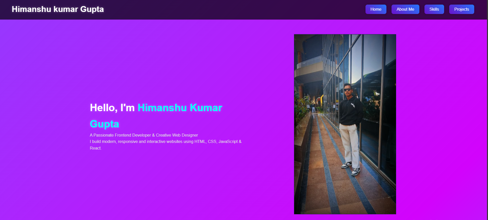

# 🌐 Personal Portfolio Website

This is my **personal portfolio website** built using **HTML, CSS, and JavaScript**.  
It showcases my skills, projects, and provides an easy way to connect with me.  

---

##  Features
- Responsive design with modern UI  
- Smooth animations and transitions  
- Dedicated sections: Home, About, Skills, Projects, Contact  
- Floating profile image animation  
- Horizontal scrolling project showcase  

---

##  Tech Stack
- HTML5  
- CSS3  
- JavaScript (Vanilla JS)  

---

##  Live Demo
🔗 [Click Here to View Portfolio](https://himanshugupta278.github.io/My-Portfolio/)  

---

##  Screenshots

---

##  Contact
- Email: **himanshu.gupta572554@gmail.com**  
- GitHub: [himanshugupta278](https://github.com/himanshugupta278)  

---

⭐ If you like this project, please give it a **star** on GitHub!

